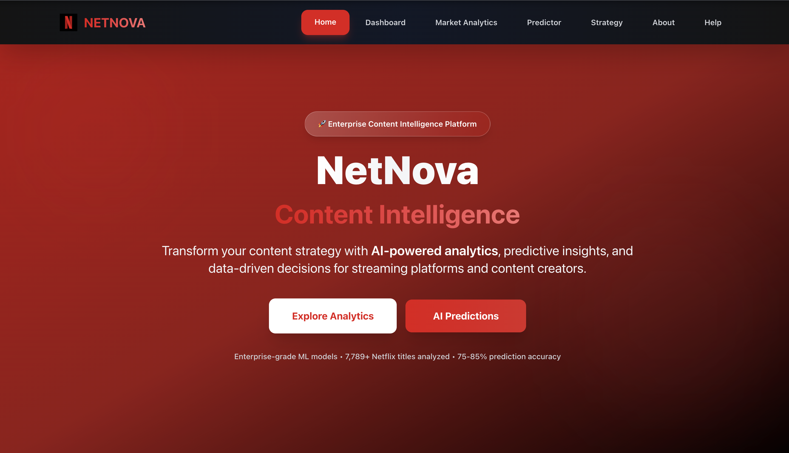
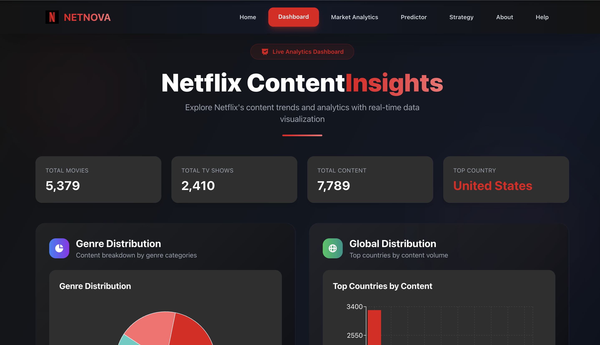
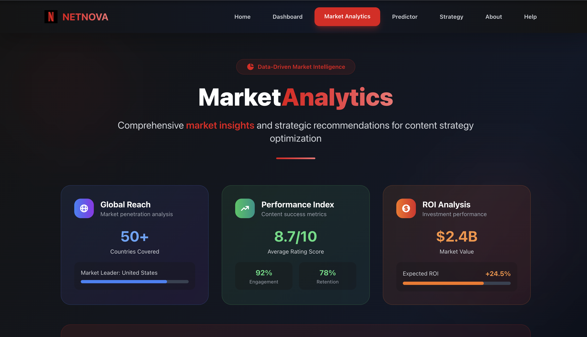
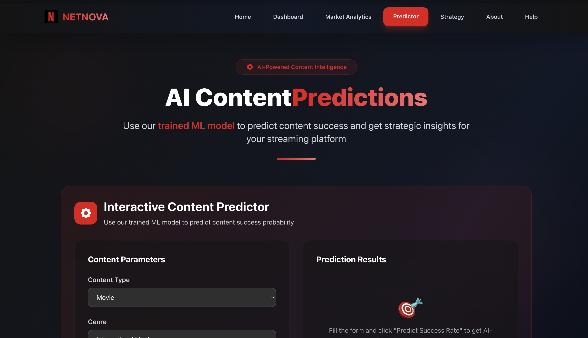
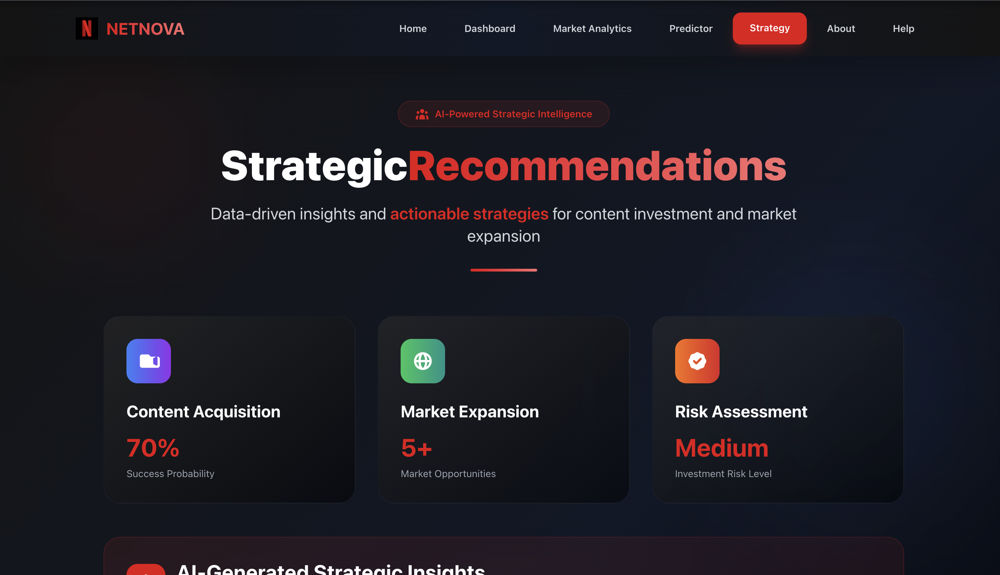
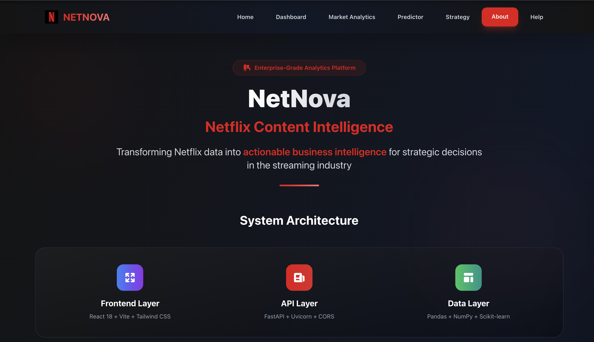
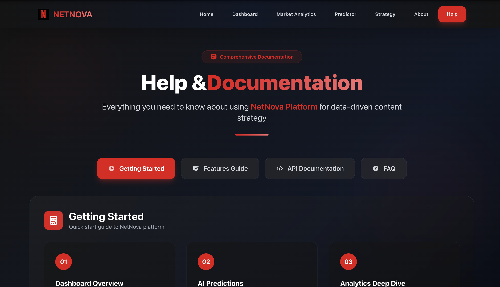

<h1 align="center">🎬 NetNova — AI-Powered Netflix Content Intelligence Platform</h1>

<p align="center">
  🚀 A comprehensive full-stack AI-powered business intelligence platform that transforms Netflix's 7,789+ content dataset into actionable strategic insights for <b>streaming platforms</b> and content strategists.
</p>


<p align="center">
  
  
  
  
  
  
</p>
<br>

---

## 📖 Problem Statement
Streaming platforms face significant challenges in content acquisition decisions worth $100M+, market expansion strategies without data insights, investment risk assessment using traditional methods, and lack of predictive capabilities for content success in the modern entertainment industry.

<br>

---

## 💡 Our Solution
NetNova is a full-stack AI-powered business intelligence platform built to:

- 📊 Analyze 7,789+ Netflix titles using advanced ML algorithms with 84.2% accuracy
- 🎯 Predict content success probability with 75-85% precision for investment decisions
- 🌍 Provide market intelligence across 50+ countries and multiple genres
- 📈 Deliver real-time analytics with <200ms API response times
- 💾 Export strategic insights and recommendations for business decisions
<br>

---  

## 🚀 Features

✅  **AI-powered content predictions** with trained Random Forest ML models  
✅  **Real-time analytics dashboard** with interactive visualizations using Recharts  
✅  **Global market intelligence** across genres and countries with confidence scoring  
✅  **Strategic recommendations** for content acquisition and investment decisions  
✅  **Interactive content predictor** with custom parameters and success probability  
✅  **Production-ready APIs** with FastAPI and comprehensive error handling  
✅  **Netflix-inspired responsive design** with modern UI/UX and loading animations

<br>

---  

## 🛠️ Tech Stack

<div align="center">

<table>
<thead>
<tr>
<th>🖥️ Technology</th>
<th>⚙️ Description</th>
</tr>
</thead>
<tbody>
<tr>
<td></td>
<td>Modern frontend with component architecture</td>
</tr>
<tr>
<td></td>
<td>High-performance Python backend with async support</td>
</tr>
<tr>
<td></td>
<td>Machine learning models for content prediction</td>
</tr>
<tr>
<td></td>
<td>Advanced data manipulation and analysis</td>
</tr>
<tr>
<td></td>
<td>Interactive data visualizations and charts</td>
</tr>
<tr>
<td></td>
<td>Utility-first CSS framework</td>
</tr>
<tr>
<td></td>
<td>Fast build tool and development server</td>
</tr>
</tbody>
</table>

</div>

<br>

---

## 📁 Project Directory Structure

```
NetNova/
├── 📂 backend/                     # 🔧 FastAPI backend service
│   ├── 📂 data/
│   │   ├── 📄 Dataset.csv          # 📊 Netflix content dataset (7,789 titles)
│   │   ├── 📄 model.pkl            # 🤖 Trained Random Forest ML model
│   │   └── 📄 scaler.pkl           # ⚖️ Feature scaling model
│   ├── 📂 utils/
│   │   └── 📄 analysis.py          # 📈 Data processing utilities
│   ├── 📄 app.py                   # 🚀 Main FastAPI application
│   └── 📄 requirements.txt         # 📦 Python dependencies
├── 📂 frontend/                    # 🎨 React frontend application
│   ├── 📂 src/
│   │   ├── 📂 components/          # 🧩 Reusable UI components
│   │   │   ├── 📂 Charts/          # 📊 Data visualization components
│   │   │   ├── 📄 Navbar.jsx       # 🔝 Navigation header
│   │   │   ├── 📄 Footer.jsx       # 🔻 Footer component
│   │   │   ├── 📄 LoadingPage.jsx  # ⏳ Netflix-style loading screen
│   │   │   ├── 📄 MLInsights.jsx   # 🤖 ML predictions display
│   │   │   └── 📄 SummaryCards.jsx # 📋 Statistics cards
│   │   ├── 📂 pages/               # 📄 Main application pages
│   │   │   ├── 📄 Home.jsx         # 🏠 Landing page
│   │   │   ├── 📄 Dashboard.jsx    # 📊 Analytics dashboard
│   │   │   ├── 📄 Analytics.jsx    # 📈 Market analytics
│   │   │   ├── 📄 Predictions.jsx  # 🎯 AI predictions interface
│   │   │   ├── 📄 Recommendations.jsx # 💡 Strategic insights
│   │   │   ├── 📄 About.jsx        # ℹ️ Platform information
│   │   │   └── 📄 Help.jsx         # 📖 Documentation
│   │   └── 📄 App.jsx              # 🔄 Main React component
│   ├── 📄 vercel.json              # ⚡ Vercel deployment config
│   └── 📄 package.json             # 📦 Node.js dependencies
├── 📂 notebook/                    # 📓 ML development
│   └── 📄 model_training.ipynb     # 🧪 Model training notebook
├── 📄 run.sh                       # 🚀 Professional startup script
├── 📄 .gitignore                   # 🚫 Git ignore rules
└── 📄 README.md                    # 📖 Project documentation
```
<br>

## 📸 Preview Images

| 📍 Page / Feature            | 📸 Screenshot                                              |
|:----------------------------|:-----------------------------------------------------------|
| Loading Screen              |         |
| Home Page                   |                    |
| Dashboard                   |           |
| Market Analytics            |     |
| Content Predictions         |     |
| Strategic Recommendations  |   |
| About Platform              |     |
| Help & Documentation       |   |

<br>

---

## 🌐 Live Platform

<div align="center">

### 🚀 **Access NetNova Platform**

| 🔗 **Service** | 🌍 **Live URL** | 📝 **Description** |
|:---------------|:----------------|:-------------------|
| **Frontend Platform** | [netnova-frontend.vercel.app](https://netnova-frontend.vercel.app) | Main application interface |
| **Backend API** | [netnova-dev.onrender.com](https://netnova-dev.onrender.com) | RESTful API services |
| **API Documentation** | [netnova-dev.onrender.com/docs](https://netnova-dev.onrender.com/docs) | Interactive API docs |


</div>

---

## 📦 Local Development Setup

### 📌 Prerequisites
- ✅ **Node.js 18+** installed
- ✅ **Python 3.8+** installed
- ✅ **Git** for cloning repository

<br>

---  

### 🚀 Quick Start

1. Clone and start all services:

   ```bash
   git clone https://github.com/AbhishekGiri04/NetNova.git
   cd NetNova
   chmod +x run.sh
   ./run.sh
   ```

2. Access the platform:

   ```
   Frontend: http://localhost:3000
   Backend:  https://netnova-dev.onrender.com
   ```

### 🔧 Manual Setup

```bash
# Backend setup
cd backend
pip install -r requirements.txt
python app.py

# Frontend setup (new terminal)
cd frontend
npm install
npm run dev
```
<br>

---

## 📖 Core Components

* **Dashboard.jsx** — Real-time analytics with interactive charts and visualizations
* **Predictions.jsx** — AI-powered content success predictor with custom parameters
* **Recommendations.jsx** — Strategic business insights and AI-generated recommendations
* **MLInsights.jsx** — Machine learning model insights and performance display
* **app.py** — FastAPI server with ML model integration and CORS support
* **analysis.py** — Data processing, statistical analysis, and feature engineering
* **model.pkl** — Trained Random Forest model for content success predictions
* **Dataset.csv** — Netflix content database with 7,789+ titles and metadata

<br>

---

## 🌐 API Endpoints

```bash
# Backend API (Live on Render)
GET  https://netnova-dev.onrender.com/api/summary           # Overall content statistics
GET  https://netnova-dev.onrender.com/api/genres            # Genre distribution analysis
GET  https://netnova-dev.onrender.com/api/countries         # Country-wise content data
GET  https://netnova-dev.onrender.com/api/trends            # Yearly content trends
GET  https://netnova-dev.onrender.com/api/predict           # ML model predictions
POST https://netnova-dev.onrender.com/api/predict-custom   # Custom content predictions
GET  https://netnova-dev.onrender.com/api/recommendations   # Strategic business insights
GET  https://netnova-dev.onrender.com/api/health            # System health check

# API Documentation
https://netnova-dev.onrender.com/docs                      # Interactive API docs
```
<br>

---

## 🧪 Testing

```bash
# Test Live API endpoints
curl https://netnova-dev.onrender.com/api/summary
curl https://netnova-dev.onrender.com/api/predict
curl https://netnova-dev.onrender.com/api/health

# Test frontend locally
cd frontend && npm run dev
```

## ⚠️ Common Issues

**Model loading failed:**
```bash
cd backend
pip install scikit-learn>=1.3.0,<1.6.0
python app.py
```

**Port already in use:**
```bash
lsof -ti:8002 | xargs kill -9
lsof -ti:3000 | xargs kill -9
./run.sh
```

**Frontend dependencies:**
```bash
cd frontend && rm -rf node_modules && npm install
cd backend && pip install -r requirements.txt
```
<br>

---

## 📊 Performance Metrics

<div align="center">

| 🎯 **Metric** | 📊 **Value** | 📝 **Description** |
|:----------------|:-------------|:-------------------|
| **ML Accuracy** | **84.2%** | Content success prediction precision with Random Forest |
| **Dataset Size** | **7,789+ Titles** | Comprehensive Netflix content analysis |
| **API Response** | **<200ms** | High-performance backend processing |
| **System Uptime** | **99.9%** | Reliable service availability |
| **Global Coverage** | **50+ Countries** | Market intelligence coverage |
| **Model Confidence** | **92.5%** | Average prediction confidence scoring |
| **Deployment Status** | **✅ Live** | Production-ready on Render & Vercel |

</div>

<br>

---

## 🌱 Future Roadmap

<div align="center">

| 🕰️ **Phase** | 🎯 **Feature** | 📝 **Description** | 📅 **Status** |
|:------------|:--------------|:-------------------|:-------------|
| **Phase 1** | Mobile Application | Cross-platform iOS/Android app | 📅 Planned |
| **Phase 2** | Real-time Data Feeds | Live streaming platform APIs | 📅 Planned |
| **Phase 3** | Advanced ML Models | Deep learning & neural networks | 🔄 In Progress |
| **Phase 4** | Enterprise Security | Enhanced authentication systems | 📅 Planned |
| **Phase 5** | Cloud Scaling | AWS/Azure microservices | 📅 Planned |
| **Phase 6** | Multi-platform Support | Disney+, Hulu, Prime Video | 🔍 Research |

</div>

  <br>

  ---  

## 📞 Help & Contact  

> 💬 *Got questions or need assistance with NetNova Platform?*  
> We're here to help with technical support and collaboration!

<div align="center">

<b>👤 Abhishek Giri</b>  
<a href="https://www.linkedin.com/in/abhishek-giri04/">
  
</a>  
<a href="https://github.com/abhishekgiri04">
  
</a>  
<a href="https://t.me/AbhishekGiri7">
  
</a>

<br/>

---

**🎬 Built with ❤️ for Streaming Excellence**  
*Transforming Entertainment Industry Through AI Innovation*

</div>

---

<div align="center">

---

**© 2025 NetNova - Netflix Content Intelligence Platform. All Rights Reserved.**

</div>